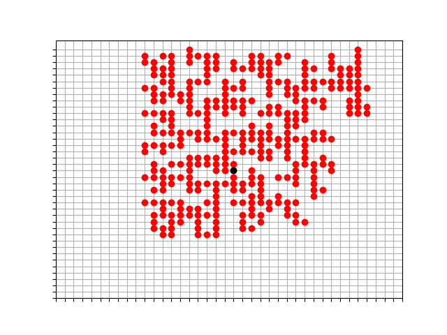

# Diffusion Limited Aggregation

<ins>D</ins>iffusion <ins>L</ins>imited <ins>A</ins>ggregation is a mathematical model proposed by Witten and Sander to describe coagulated aerosol aggregates of solid particles.  
  
For more information, visit [Paul Bourke's Website] (http://paulbourke.net/fractals/dla/)