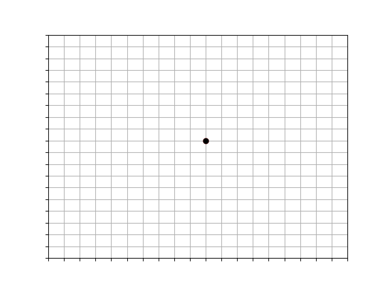

# Diffusion Limited Aggregation

**D**iffusion **L**imited **A**ggregation is a mathematical model proposed by Witten and Sander to describe coagulated aerosol aggregates of solid particles. The model simulates discrete dendritic growth that exhibit power-law correlations. Particles appear to coalesce *irreversibly* to form the aggregates, and it is proposed that two particles stick together whenever their thermal motion bringst them into contact.

For more information, visit [Paul Bourke's page](http://paulbourke.net/fractals/dla/).  

-------
## DLA

The model is a variant of the Eden model. In the Eden model, a seed particle at the origin of a discrete lattice represents the initial state.

A second particle is randomly generated at some large distance away from the origin 

\(  X_0 = (X, Y) \in [\frac{-\text{Axis Length}}{2}, \frac{\text{Axis Length}}{2}] \subset \N \\ \scriptsize{ \; where \;} X,Y \scriptsize{\; are\: Random\: Variables}  \)

The particle walks randomly until it visits a site adjacent to the seed, where it sticks to become part of the cluster.

